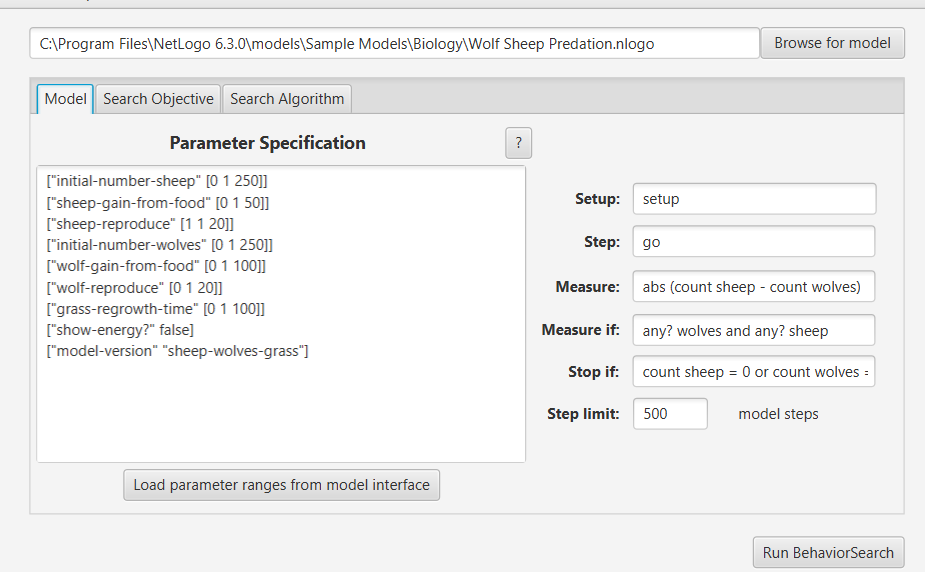
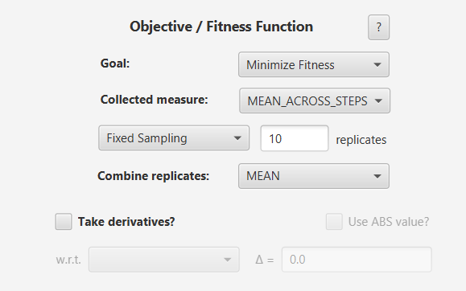
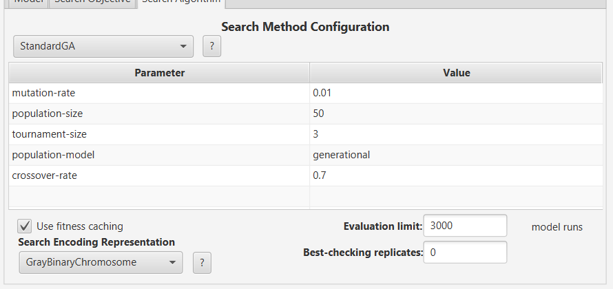
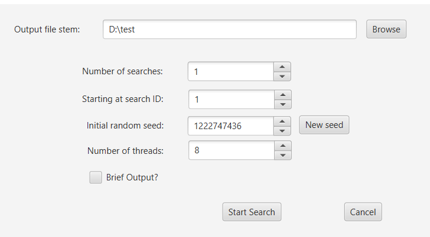
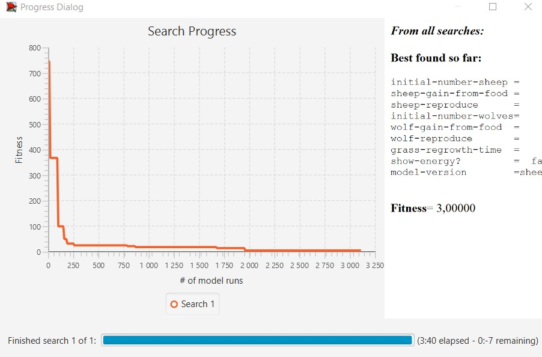
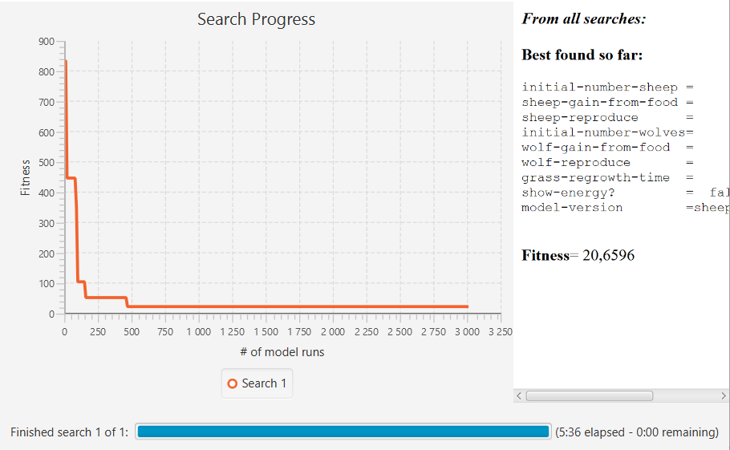

## Комп'ютерні системи імітаційного моделювання
## СПм-22-3, **Риндик Ігор Вікторович**

### Лабораторна робота №**2**. Використання засобів обчислювального интелекту для оптимізації імітаційних моделей

 

### Варіант 7, модель у середовищі NetLogo:
[Wolf Sheep Predation](http://www.netlogoweb.org/launch#http://www.netlogoweb.org/assets/modelslib/Sample%20Models/Biology/Wolf%20Sheep%20Predation.nlogo)

 

#### Опис моделі:
Модель була описана у ході виконання лабораторної роботи №1 - [Опис](https://github.com/IgorRyndik/Simulation1)

 

### Налаштування середовища BehaviorSearch:

**Обрана модель**:
<pre>
C:\Program Files\NetLogo 6.3.0\models\Sample Models\Biology\Wolf Sheep Predation.nlogo
</pre>

**Параметри моделі** (вкладка Model): 

<pre>
["initial-number-sheep" [0 1 250]]
["sheep-gain-from-food" [0 1 50]]
["sheep-reproduce" [1 1 20]]
["initial-number-wolves" [0 1 250]]
["wolf-gain-from-food" [0 1 100]]
["wolf-reproduce" [0 1 20]]
["grass-regrowth-time" [0 1 100]]
["show-energy?" false]
["model-version" "sheep-wolves-grass"]
</pre>

Використовувана **міра**:  
Для фітнес-функції *(вона ж функція пристосованості або цільова функція)* було обрано **різниця по модулю між популяціями вовків та овець**:
<pre>
abs (count sheep - count wolves)
</pre>

Загальний вигляд вкладки налаштувань параметрів моделі:

**Налаштування цільової функції** (вкладка Search Objective):  
Метою підбору параметрів імітаційної моделі, що описує взаємодію хижак-жертва, є **мінімізація** значення різниці між популяціями вовків та вівець – це вказано через параметр "**Goal**" зі значенням **Minimize Fitness**. При цьому цікавить не просто різниця між популяціями у якийсь окремий момент симуляції, а середнє її значення за всю симуляцію (тривалість якої (500 кроків) вказувалася на минулій вкладці). Для цього у параметрі "**Collected measure**", що визначає спосіб обліку значень обраного показника, вказано **MEAN_ACROSS_STEPS**.  
Щоб уникнути викривлення результатів через випадкові значення, що використовуються в логіці самої імітаційної моделі, **кожна симуляція повторюється по 10 разів**, результуюче значення розраховується як **середнє арифметичне**. 
Загальний вигляд вкладки налаштувань цільової функції:  

Загальний вид вкладки налаштувань алгоритму пошуку:  

 

### Результати використання BehaviorSearch:
Діалогове вікно запуску пошуку:  

Результат пошуку параметрів імітаційної моделі, використовуючи **генетичний алгоритм**:  

Знайдені параметри:
<pre>
Best found so far:

initial-number-sheep =    112
sheep-gain-from-food =      8
sheep-reproduce      =      4
initial-number-wolves=     78
wolf-gain-from-food  =     18
wolf-reproduce       =      5
grass-regrowth-time  =     73
show-energy?         =  false
model-version        =sheep-wolves-grass

</pre>

Результат пошуку параметрів імітаційної моделі, використовуючи **випадковий пошук**:  

Знайдені параметри:
<pre>
Best found so far:

initial-number-sheep =      2
sheep-gain-from-food =     36
sheep-reproduce      =      4
initial-number-wolves=     40
wolf-gain-from-food  =     15
wolf-reproduce       =      8
grass-regrowth-time  =     45
show-energy?         =  false
model-version        =sheep-wolves-grass

</pre>